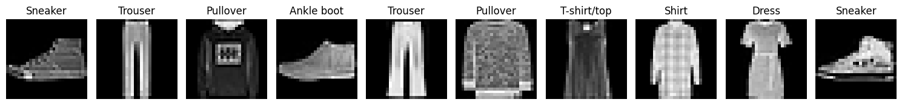

# Analyzing Fashion Items! 🧥
Using a K-Nearest Neighbor Classifier with Scikit-Learn to predict what fashion item a given picture belongs to!

## Visuals
First collected data from the Fashion MNIST data set. One link to it here: https://www.kaggle.com/datasets/zalando-research/fashionmnist. This data set is widely recognized as a good benchmark to work with.

Here are some examples of the data.

In one experiment, the model was trained with different k-values and weighting schemes to achieve the lowest error ratio.

In another experiment, the data was transformed with PCA (Principal Component Analysis) and trained with different k-values and number of 'principal components' to consider.

The results for the two experiments and their overall accuracy is discussed in the notebook!

## Background
A *K-Nearest Neighbor* model is used to classify items to a label. The *k* represents how many of the closest known data points to a new data point to take into consideration. One example, if a new data point is open for labeling and its *k* nearest neighbors are of label 'red', then the new data point will also be 'red'. Different weighing schemes however, can influence how important every individual neighboring data point is.

*Principal Component Analysis* is a dimensionality reduction technique, meant to make data computationally smaller yet still retain its important information. The data is statistically correlated to form *principal components* that are used as input to learning models.